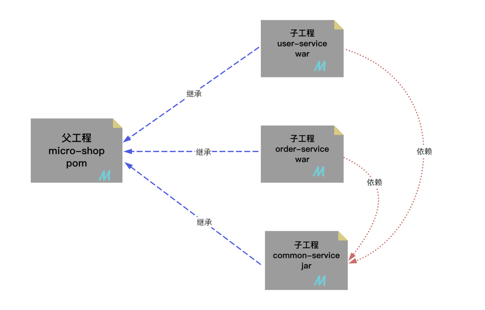

# MavenTutorial: 高效构建Java应用 -- Maven入门和进阶

## 一、Maven简介和快速入门
### 1. Maven 介绍
Maven 是一款为 Java 项目构建管理、依赖管理的工具（**软件**），使用 Maven 可以自动化构建、测试、打包和发布项目，大大提高了开发效率和质量。

✅ **总结:** Maven就是一个软件，掌握软件安装、配置、以及基本功能**（项目构建、依赖管理）**使用就是本课程的主要目标！

### 2. Maven 主要作用理解
1. 场景
   1. 引入依赖
   2. 项目构建和打包
2. 依赖管理
3. 构建管理
   * 项目构建是将源代码、配置文件、资源文件等转化为能够运行或部署的应用程序或库的过程。
   * `清理 --> 编译 --> 测试 --> 报告 --> 打包 --> 部署`
   * Maven 可以管理项目的编译、测试、打包、部署等构建过程。通过实现标准的构建生命周期，Maven 可以确保每一个构建过程都遵循同样的规则和最佳实践。同时，Maven 的插件机制也使得开发者可以对构建过程进行扩展和定制。主动触发构建，只需要简单的命令操作即可。

### 3. Maven 安装和配置
1. 安装和测试
   ```shell
   brew install maven
   
   ➜  ~ mvn -v
   Apache Maven 3.9.10 (5f519b97e944483d878815739f519b2eade0a91d)
   Maven home: /opt/homebrew/Cellar/maven/3.9.10/libexec
   Java version: 24.0.1, vendor: Homebrew, runtime: /opt/homebrew/Cellar/openjdk/24.0.1/libexec/openjdk.jdk/Contents/Home
   Default locale: en_US, platform encoding: UTF-8
   OS name: "mac os x", version: "15.5", arch: "aarch64", family: "mac"
   ```
2. 配置文件: `/opt/homebrew/Cellar/maven/3.9.10/libexec/conf/settings.xml`
   1. 配置本地仓库地址 (Optional, I use default value)
   2. 配置国内阿里镜像 (针对国内的程序员)
   3. 配置jdk17版本项目构建
3. 配置 IDEA 使用本地安装的 Maven
   1. IDEA 工具默认自带 Maven 配置软件，但是因为没有修改配置，**建议替换成本地配置好的 Maven！**
   2. `Settings --> Build --> Build Tools --> Maven`
   3. 选择 Maven 的安装路径，即 `mvn -v` 输出中的 `Maven home`
   4. 
   5. 


## 二、基于IDEA的Maven工程创建
### 1. 梳理Maven工程GAVP属性
> Maven工程相对之前的工程，多出一组gavp属性，gav需要我们在创建项目的时指定，p有默认值，后期通过配置文件修改。既然要填写的属性，我们先行了解下这组属性的含义!

Maven 中的 GAVP 是指 **GroupId、ArtifactId、Version、Packaging** 等四个属性的缩写，其中前三个是必要的，而 Packaging 属性为可选项。这四个属性主要为每个项目在maven仓库总做一个标识，类似人的《姓-名》。有了具体标识，方便maven软件对项目进行管理和互相引用！

GAV遵循一下规则：
1. `GroupID` 格式：`com.{公司/BU}.业务线.[子业务线]`，最多 4 级。
   * 说明：{公司/BU} 例如：alibaba/taobao/tmall/aliexpress 等 BU 一级；子业务线可选。
   * 正例：com.taobao.tddl 或 com.alibaba.sourcing.multilang com.atguigu.java
2. `ArtifactID` 格式：`产品线名-模块名`。语义不重复不遗漏，先到仓库中心去查证一下。
   * 正例：tc-client / uic-api / tair-tool / bookstore
3. `Version` 版本号格式推荐：`主版本号.次版本号.修订号` 1.0.0
   1. 主版本号：当做了不兼容的 API 修改，或者增加了能改变产品方向的新功能。
   2. 次版本号：当做了向下兼容的功能性新增（新增类、接口等）。
   3. 修订号：修复 bug，没有修改方法签名的功能加强，保持 API 兼容性。
   * 例如： 初始→1.0.0 修改bug → 1.0.1 功能调整 → 1.1.1等
4. `Packaging` 定义规则：
   * 指示将项目打包为什么类型的文件，idea根据packaging值，识别maven项目类型！
   * packaging 属性为 `jar`（默认值），代表普通的Java工程，打包以后是.jar结尾的文件。
   * packaging 属性为 `war`，代表Java的web工程，打包以后.war结尾的文件。
   * packaging 属性为 `pom`，代表不会打包，用来做继承的父工程。

### 2. 创建 Java SE 工程 (即 Java 普通工程)
```
➜  javase-project-01 git:(main) ✗ tree -L 3
.
├── pom.xml
└── src
    ├── main
    │   ├── java (存放java源代码)
    │   └── resources (存放配置文件)
    └── test
        └── java
```

### 3. Java EE 工程, 即 Java Web 工程
#### Method 1. 手动创建 Java SE 工程，然后转换为 Java EE 工程
1. 创建一个 Java SE Maven 工程
2. 补全文件结构
    ```
    ➜  project-02-javaee git:(main) ✗ tree -L 5
    .
    ├── pom.xml
    └── src
        ├── main
        │   ├── java
        │   │    └── com
        │   │        └── ylqi007
        │   ├── resources
        │   └── webapp (要补全的部分: webapp, WEB-INF, web.xml)
        │       └── WEB-INF
        │            └── web.xml
        └── test
            └── java
    ```
3. 修改 pom.xml 文件，将 `packaging` 设置为 `war`
4. 刷新 Maven 结构，`webapp` 上会多一个小蓝点，`webapp` 文件夹出现小蓝点，代表成功！！!

#### Method 2. 通过插件创建 Java EE 工程
1. 安装 `JBLJavaToWeb` 插件
2. 创建 Java SE Maven 工程
3. 选择相应的 module，右击，使用 JBL 就能快速补全 Web 项目

### 4. Maven 工程项目结构说明
Maven 是一个强大的构建工具，它提供一种标准化的项目结构，可以帮助开发者更容易地管理项目的依赖、构建、测试和发布等任务。以下是 Maven Web 程序的文件结构及每个文件的作用：
```
|-- pom.xml                               # Maven 项目管理文件 
|-- src
    |-- main                              # 项目主要代码
    |   |-- java                          # Java 源代码目录
    |   |   `-- com/example/myapp         # 开发者代码主目录
    |   |       |-- controller            # 存放 Controller 层代码的目录
    |   |       |-- service               # 存放 Service 层代码的目录
    |   |       |-- dao                   # 存放 DAO 层代码的目录
    |   |       `-- model                 # 存放数据模型的目录
    |   |-- resources                     # 资源目录，存放配置文件、静态资源等
    |   |   |-- log4j.properties          # 日志配置文件
    |   |   |-- spring-mybatis.xml        # Spring Mybatis 配置文件
    |   |   `-- static                    # 存放静态资源的目录
    |   |       |-- css                   # 存放 CSS 文件的目录
    |   |       |-- js                    # 存放 JavaScript 文件的目录
    |   |       `-- images                # 存放图片资源的目录
    |   `-- webapp                        # 存放 WEB 相关配置和资源
    |       |-- WEB-INF                   # 存放 WEB 应用配置文件
    |       |   |-- web.xml               # Web 应用的部署描述文件
    |       |   `-- classes               # 存放编译后的 class 文件
    |       `-- index.html                # Web 应用入口页面
    `-- test                              # 项目测试代码
        |-- java                          # 单元测试目录
        `-- resources                     # 测试资源目录
```
* `pom.xml`：Maven 项目管理文件，用于描述项目的依赖和构建配置等信息。
* `src/main/java`：存放项目的 Java 源代码。
* `src/main/resources`：存放项目的资源文件，如配置文件、静态资源等。
* `src/main/webapp/WEB-INF`：存放 Web 应用的配置文件。
* `src/main/webapp/index.html`：Web 应用的入口页面。
* `src/test/java`：存放项目的测试代码。
* `src/test/resources`：存放测试相关的资源文件，如测试配置文件等。


## 三、Maven核心功能依赖和构建管理
### 1. 依赖管理和配置
Maven 的依赖管理是 Maven 软件中最重要的功能之一。它能够帮助开发人员自动解决软件包依赖问题，使得开发人员能够轻松地将其他开发人员开发的模块或第三方构架集成到自己的程序或模块中，避免出现版本冲突和依赖缺失等问题。

我们通过定义 POM 文件，Maven 能够自动解析项目的依赖关系，并通过 Maven 仓库自动下载和管理依赖，从而避免了手动下载和管理依赖的繁琐工作和可能引发的版本冲突问题。

✅ **重点: 编写pom.xml文件!**

1. maven项目信息属性配置和读取：
   ```xml
   <!-- 模型版本 -->
   <modelVersion>4.0.0</modelVersion>
   <!-- 公司或者组织的唯一标志，并且配置时生成的路径也是由此生成， 如com.companyname.project-group，maven会将该项目打成的jar包放本地路径：/com/companyname/project-group -->
   <groupId>com.companyname.project-group</groupId>
   <!-- 项目的唯一ID，一个groupId下面可能多个项目，就是靠artifactId来区分的 -->
   <artifactId>project</artifactId>
   <!-- 版本号 -->
   <version>1.0.0</version>
   
   <!--打包方式
       默认：jar
       jar指的是普通的java项目打包方式！ 项目打成jar包！
       war指的是web项目打包方式！项目打成war包！
       pom不会讲项目打包！这个项目作为父工程，被其他工程聚合或者继承！后面会讲解两个概念
   -->
   <packaging>jar/pom/war</packaging>
   ```
2. maven项目信
   ```xml
   <!-- 
      通过编写依赖jar包的gav必要属性，引入第三方依赖！
      scope属性是可选的，可以指定依赖生效范围！
      依赖信息查询方式：
         1. maven仓库信息官网 https://mvnrepository.com/
         2. mavensearch插件搜索
    -->
   <dependencies>
       <!-- 引入具体的依赖包 -->
       <dependency>
           <groupId>log4j</groupId>
           <artifactId>log4j</artifactId>
           <version>1.2.17</version>
           <!--
               生效范围
               - compile ：main目录 test目录  打包打包 [默认]
               - provided：main目录 test目录  Servlet
               - runtime： 打包运行           MySQL
               - test:    test目录           junit
            -->
           <scope>runtime</scope>
       </dependency>
   
   </dependencies>
   ```
3. 依赖版本提取和维护:
   ```xml
   <!--声明版本-->
   <properties>
     <!--命名随便,内部制定版本号即可！-->
     <junit.version>4.11</junit.version>
     <!-- 也可以通过 maven规定的固定的key，配置maven的参数！如下配置编码格式！-->
     <project.build.sourceEncoding>UTF-8</project.build.sourceEncoding>
     <project.reporting.outputEncoding>UTF-8</project.reporting.outputEncoding>
   </properties>
   
   <dependencies>
     <dependency>
       <groupId>junit</groupId>
       <artifactId>junit</artifactId>
       <!--引用properties声明版本 -->
       <version>${junit.version}</version>
     </dependency>
   </dependencies>
   ```

### 2. 依赖传递和依赖冲突
#### 依赖传递
**依赖传递**指的是当一个模块或库 A 依赖于另一个模块或库 B，而 B 又依赖于模块或库 C，那么 A 会间接依赖于 C。这种依赖传递结构可以形成一个依赖树。当我们引入一个库或框架时，构建工具（如 Maven、Gradle）会自动解析和加载其所有的直接和间接依赖，确保这些依赖都可用。

**依赖传递**的作用是：
1. 减少重复依赖：当多个项目依赖同一个库时，Maven 可以自动下载并且只下载一次该库。这样可以减少项目的构建时间和磁盘空间。
2. 自动管理依赖: Maven 可以自动管理依赖项，使用依赖传递，简化了依赖项的管理，使项目构建更加可靠和一致。 
3. 确保依赖版本正确性：通过依赖传递的依赖，之间都不会存在版本兼容性问题，确实依赖的版本正确性！

依赖传递演示：
* 项目中，需要导入jackson相关的依赖，通过之前导入经验，jackson需要导入三个包，分别为：`jackson-databind, jackson-core, jackson-annotations`
* `jackson-databind` 依赖另外两个包 (`Compile dependencies`)，https://mvnrepository.com/artifact/com.fasterxml.jackson.core/jackson-databind/2.18.4
* 最佳导入：直接可以导入`jackson-databind`，自动依赖传递需要的另外两个依赖。

#### 依赖冲突
当直接引用或者间接引用出现了相同的jar包! 这时呢，一个项目就会出现相同的重复jar包，这就算作冲突！依赖冲突避免出现重复依赖，并且终止依赖传递！

maven自动解决依赖冲突问题能力，会按照自己的原则，进行重复依赖选择。同时也提供了手动解决的冲突的方式，不过不推荐！

解决依赖冲突（如何选择重复依赖）方式：
1. **自动选择原则**
   1. 短路优先原则（第一原则）
      * A—>B—>C—>D—>E—>X(version 0.0.1)
      * A—>F—>X(version 0.0.2)
      * 则A依赖于X(version 0.0.2)。
   2. 依赖路径长度相同情况下，则“先声明优先”（第二原则）
      * A—>E—>X(version 0.0.1)
      * A—>F—>X(version 0.0.2)
      * 在<depencies></depencies>中，先声明的，路径相同，会优先选择！

### 3. 依赖导入失败场景和解决方案
在使用 Maven 构建项目时，可能会发生依赖项下载错误的情况，主要原因有以下几种：
1. 下载依赖时出现网络故障或仓库服务器宕机等原因，导致无法连接至 Maven 仓库，从而无法下载依赖。
2. 依赖项的版本号或配置文件中的版本号错误，或者依赖项没有正确定义，导致 Maven 下载的依赖项与实际需要的不一致，从而引发错误。
3. 本地 Maven 仓库或缓存被污染或损坏，导致 Maven 无法正确地使用现有的依赖项，并且也无法重新下载！

**解决方案:**
1. 检查网络连接和 Maven 仓库服务器状态。
2. 确保依赖项的版本号与项目对应的版本号匹配，并检查 POM 文件中的依赖项是否正确。
3. 清除本地 Maven 仓库缓存（lastUpdated 文件），因为只要存在lastupdated缓存文件，刷新也不会重新下载。本地仓库中，根据依赖的gav属性依次向下查找文件夹，最终删除内部的文件，刷新重新下载即可！


### 4. 扩展构建管理和插件配置
#### 1. 构建概念
项目构建是指将**源代码、依赖库和资源文件等转换成可执行或可部署的应用程序**的过程，在这个过程中包括编译源代码、链接依赖库、打包和部署等多个步骤。


#### 2. 主动触发场景
* 重新编译: 编译不充分, 部分文件没有被编译!
* 打包: 独立部署到外部服务器软件,打包部署
* 部署本地或者私服仓库: 将 Maven 工程加入到本地或者私服仓库,供其他工程使用

#### 3. 命令方式构建
语法: `mvn 构建命令 构建命令...` (即可以有多条构建命令，比如 `mvn clean package install`)


```shell
mvn install
...
[INFO] --- install:3.1.2:install (default-install) @ project-05-pom-build ---
[INFO] Installing /Users/ylqi007/Work/MavenTutorial/project-05-pom-build/pom.xml to /Users/ylqi007/.m2/repository/com/ylqi007/project-05-pom-build/1.0-SNAPSHOT/project-05-pom-build-1.0-SNAPSHOT.pom
[INFO] Installing /Users/ylqi007/Work/MavenTutorial/project-05-pom-build/target/project-05-pom-build-1.0-SNAPSHOT.jar to /Users/ylqi007/.m2/repository/com/ylqi007/project-05-pom-build/1.0-SNAPSHOT/project-05-pom-build-1.0-SNAPSHOT.jar
```

⚠️注意:
1. 执行 `mvn` 命令需要进入到项目的根路径，即 `pom.xml` 所在的目录，也即是与 `pom.xml` 平级
2. 部署必须是 jar 包形式，war 包应该放到 服务器软件 中执行，比如 tomcat

除了**命令构建的方式**之外，还有**可视化方式构建**。

#### 4. 构建命令周期
构建命令周期：简化出发构建命令过程！

**构建生命周期**可以理解成是一组固定构建命令的有序集合，触发周期后的命令，会自动触发周期前的命令！也是一种简化构建的思路!
* **清理周期**：主要是对项目编译生成文件进行清理
   * 包含命令：`clean`
* **默认周期**：定义了真正构件时所需要执行的所有步骤，它是生命周期中最核心的部分
   * 包含命令：`compile - test - package - install / deploy`
* 报告周期
   * 包含命令：`site`
   * 打包: `mvn clean package`
   * 部署到本地仓库: `mvn clean install`

**最佳使用方案:**
```
打包: mvn clean package
重新编译: mvn clean compile
本地部署: mvn clean install
```

#### 5. 周期，命令和插件
* 周期 → 包含若干命令→包含若干插件!
* 使用周期命令构建，简化构建过程！
* 最终进行构建的是插件！

插件配置:
```xml
<build>
   <!-- jdk17 和 war包版本插件不匹配 -->
    <plugins>
        <plugin>
            <groupId>org.apache.maven.plugins</groupId>
            <artifactId>maven-war-plugin</artifactId>
            <version>3.2.2</version>
        </plugin>
    </plugins>
</build>
```


## 四、Maven 的继承和聚合特性
### 1. 继承
1. Maven 的继承概念: **Maven 继承**是指在 Maven 的项目中，让一个项目从另一个项目中继承配置信息的机制。继承可以让我们在多个项目中共享同一配置信息，简化项目的管理和维护工作。
2. Maven 继承作用: 在父工程中统一管理项目中的依赖信息,进行统一版本管理!
   * 通过在父工程中为整个项目维护依赖信息的组合既保证了整个项目使用规范、准确的 jar 包；又能够将以往的经验沉淀下来，节约时间和精力。
3. 继承语法
   * 父工程
      ```xml
      <groupId>com.atguigu.maven</groupId>
      <artifactId>pro03-maven-parent</artifactId>
      <version>1.0-SNAPSHOT</version>
         <!-- 当前工程作为父工程，它要去管理子工程，所以打包方式必须是 pom -->
      <packaging>pom</packaging>
      ```
   * 子工程
      ```xml
      <!-- 使用parent标签指定当前工程的父工程 -->
      <parent>
        <!-- 父工程的坐标 -->
        <groupId>com.atguigu.maven</groupId>
        <artifactId>pro03-maven-parent</artifactId>
        <version>1.0-SNAPSHOT</version>
      </parent>
      
      <!-- 子工程的坐标 -->
      <!-- 如果子工程坐标中的groupId和version与父工程一致，那么可以省略 -->
      <!-- <groupId>com.atguigu.maven</groupId> -->
      <artifactId>pro04-maven-module</artifactId>
      <!-- <version>1.0-SNAPSHOT</version> -->
      ```
4. 父工程依赖统一管理
   * 父工程声明版本
      ```xml
      <!-- 使用dependencyManagement标签配置对依赖的管理 -->
      <!-- 被管理的依赖并没有真正被引入到工程 -->
      <dependencyManagement>
        <dependencies>
          <dependency>
            <groupId>org.springframework</groupId>
            <artifactId>spring-core</artifactId>
            <version>4.0.0.RELEASE</version>
          </dependency>
          <dependency>
            <groupId>org.springframework</groupId>
            <artifactId>spring-beans</artifactId>
            <version>4.0.0.RELEASE</version>
          </dependency>
          <dependency>
            <groupId>org.springframework</groupId>
            <artifactId>spring-context</artifactId>
            <version>4.0.0.RELEASE</version>
          </dependency>
          <dependency>
            <groupId>org.springframework</groupId>
            <artifactId>spring-expression</artifactId>
            <version>4.0.0.RELEASE</version>
          </dependency>
          <dependency>
            <groupId>org.springframework</groupId>
            <artifactId>spring-aop</artifactId>
            <version>4.0.0.RELEASE</version>
          </dependency>
        </dependencies>
      </dependencyManagement>
      ```
   * 子工程引用版本
      ```xml
      <!-- 子工程引用父工程中的依赖信息时，可以把版本号去掉。  -->
      <!-- 把版本号去掉就表示子工程中这个依赖的版本由父工程决定。 -->
      <!-- 具体来说是由父工程的dependencyManagement来决定。 -->
      <dependencies>
        <dependency>
          <groupId>org.springframework</groupId>
          <artifactId>spring-core</artifactId>
        </dependency>
        <dependency>
          <groupId>org.springframework</groupId>
          <artifactId>spring-beans</artifactId>
        </dependency>
        <dependency>
          <groupId>org.springframework</groupId>
          <artifactId>spring-context</artifactId>
        </dependency>
        <dependency>
          <groupId>org.springframework</groupId>
          <artifactId>spring-expression</artifactId>
        </dependency>
        <dependency>
          <groupId>org.springframework</groupId>
          <artifactId>spring-aop</artifactId>
        </dependency>
      </dependencies>
      ```

### 2. 聚合
1. 聚合概念: **Maven 聚合**是指将多个项目组织到一个父级项目中，通过触发父工程的构建,统一按顺序触发子工程构建的过程!!
2. 聚合作用
   1. 统一管理子项目构建：通过聚合，可以将多个子项目组织在一起，方便管理和维护。
   2. 优化构建顺序：通过聚合，可以对多个项目进行顺序控制，避免出现构建依赖混乱导致构建失败的情况。
3. 聚合语法: 父项目中包含的子项目列表。
   ````xml
   <project>
     <groupId>com.example</groupId>
     <artifactId>parent-project</artifactId>
     <packaging>pom</packaging>
     <version>1.0.0</version>
     <modules>
       <module>child-project1</module>
       <module>child-project2</module>
     </modules>
   </project>
   ```
4. 聚合演示: 通过触发父工程构建命令、引发所有子模块构建！产生反应堆！


## 五、Maven 实战案例
### 1. 项目需求和结构分析

* 需求案例：搭建一个电商平台项目，该平台包括用户服务、订单服务、通用工具模块等。
* 项目架构：
  * 用户服务：负责处理用户相关的逻辑，例如用户信息的管理、用户注册、登录等。
  * 订单服务：负责处理订单相关的逻辑，例如订单的创建、订单支付、退货、订单查看等。
  * 通用模块：负责存储其他服务需要通用工具类，其他服务依赖此模块。
* 服务依赖：
  * `user-service` (1.0.1, `war`)
    * spring-context 6.0.6
    * spring-core 6.0.6
    * spring-beans 6.0.6
    * jackson-databind / jackson-core / jackson-annotations 2.15.0
  * `order-service` (1.0.1, `war`)
    * shiro-core 1.10.1
    * spring-context 6.0.6
    * spring-core 6.0.6
    * spring-beans 6.0.6
  * `common-library` (1.0.1, `jar`) 需要将该package安装到本地仓库，然后 `user-service` and `order-service` 会引用这两个
    * commons-io 2.11.0

### 2. 项目搭建和统一构建

Install `common-library` to local repository
```shell
[INFO] --- install:3.1.2:install (default-install) @ common-library ---
[INFO] Installing /Users/ylqi007/Work/MavenTutorial/project-07-micro-shop/common-library/pom.xml to /Users/ylqi007/.m2/repository/com/ylqi007/common-library/1.0.1/common-library-1.0.1.pom
[INFO] Installing /Users/ylqi007/Work/MavenTutorial/project-07-micro-shop/common-library/target/common-library-1.0.1.jar to /Users/ylqi007/.m2/repository/com/ylqi007/common-library/1.0.1/common-library-1.0.1.jar
```
将 `common-library` 安装到本地仓库后，`user-service` and `order-service` 就可以像引用其他第三方依赖的方式引用 `common-library`。


## 六、Maven 核心掌握


## Reference
* ✅ 尚硅谷 B站视频: [尚硅谷新版SSM框架全套视频教程，Spring6+SpringBoot3最新SSM企业级开发](https://www.bilibili.com/video/BV1AP411s7D7/?spm_id_from=333.788.player.switch&vd_source=bd5e1cdd20d83feef8e77a781b33f083&p=1)
* ✅ https://www.wolai.com/fbnhGx8eE9JfZugFpbCWmC
* 课件: https://www.wolai.com/v5Kuct5ZtPeVBk4NBUGBWF
* [Apache Maven Project](https://maven.apache.org/what-is-maven.html)
* Maven plugins: https://maven.apache.org/plugins/
* ✅ GitHub: https://github.com/xftxyz2001/atguigu-ssm/tree/main (很完整，包括笔记和代码)
* [Where is Maven's settings.xml located on Mac OS?](https://stackoverflow.com/questions/3792842/where-is-mavens-settings-xml-located-on-mac-os)


## Setup GitHub Repository
### Create a new repository on the command line
```shell
echo "# MavenTutorial01" >> README.md
git init
git add README.md
git commit -m "first commit"
git branch -M main
git remote add origin git@github.com:ylqi007/MavenTutorial01.git
git push -u origin main
```

### Push an existing repository from the command line
```shell
git remote add origin git@github.com:ylqi007/MavenTutorial01.git
git branch -M main
git push -u origin main
```